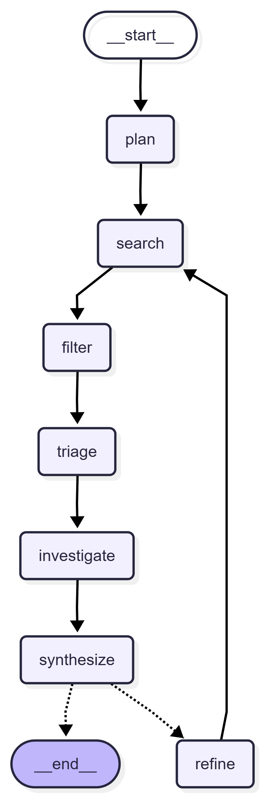

# Active Tech-Radar RAG

主动式领域动态追踪与提纯引擎。以 LangGraph 为核心编排，按需触发检索、过滤、总结，并在证据不足时自动回环深挖。

## 功能概览
- **Query Planner**：把问题转成多条可执行搜索查询
- **Web Search**：按查询并行检索（支持 `ddgs` 或 `tavily`）
- **Page Cache**：首轮搜索后缓存搜索结果自带的详细内容，后续调查直接复用
- **Noise Filter**：LLM 评分筛选高相关结果
- **Link Triage**：LLM 判断哪些链接值得抓取正文进一步研究
- **Page Investigator**：从首轮缓存中读取入选链接的详细内容和元数据，补强证据
- **Synthesizer**：基于证据输出摘要（带引用）
- **Deep Dive Loop**：证据不足时自动生成追问并二次检索

## 快速开始

1. 安装依赖
```bash
pip install -e .
```

2. 配置环境变量
```bash
copy .env.example .env
```
编辑 `.env`，填写 `OPENAI_API_KEY`（可选填 `TAVILY_API_KEY`）。

3. 运行
```bash
active-tech-radar "过去一周有没有比 DPO 更轻量的对齐算法？"
active-tech-radar "过去一周有没有比 DPO 更轻量的对齐算法？" --backend tavily
```

## 运行参数
- `--backend`：`ddgs`（默认）或 `tavily`
- `--max-results`：每个查询最大抓取条数
- `--max-iterations`：最大深挖轮数
- `--max-deep-links`：每轮最多深入抓取正文的链接数
- `--model`：OpenAI 模型名（默认读取 `OPENAI_MODEL`）
- `--log-file`：日志文件路径（默认 `active_radar.log`）
- `--output-dir`：答案与详细证据文件输出目录（默认 `outputs`）
- `--diagram`：生成流程图（`mermaid` 或 `png`，默认 `none`）
- `--diagram-file`：流程图输出文件名（默认 `graph.mmd` 或 `graph.png`）

示例：
```bash
active-tech-radar "某开源库最新 Issue 里有没有内存泄漏修复方案？" --backend tavily --max-iterations 3
```

生成流程图：
```bash
active-tech-radar "demo" --diagram mermaid
active-tech-radar "demo" --diagram png --diagram-file radar.png
```

流程图预览：



## 输出格式
输出为简明摘要，并使用 `[n]` 引用编号标注来源链接。若证据不足，会在摘要里指出缺口，并自动触发深挖。
每次运行还会额外输出两份文件：`*_answer.md` 保存答案，`*_evidence.json` 保存详细证据内容。

## 日志
每个步骤都会输出日志到控制台，并写入到日志文件（默认 `active_radar.log`）。
